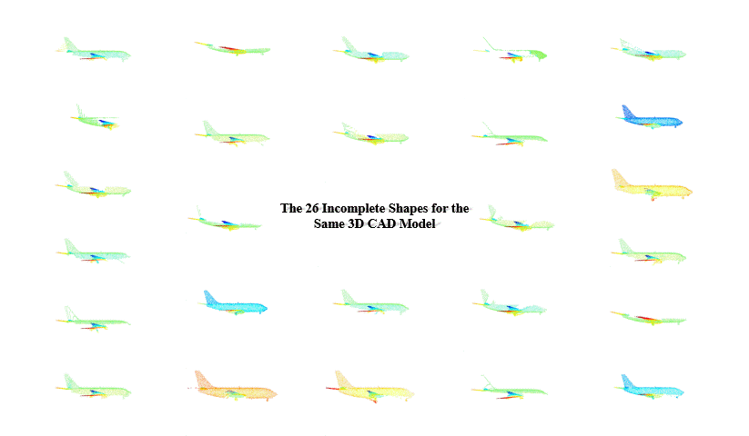

# *MVP Benchmark:* Multi-View Partial Point Clouds for Completion and Registration
<p align="center"> 

</p>


## [NEWS]
- **2021-07-12 [NEW:tada:]** The submission on [Codalab](https://competitions.codalab.org/competitions/33430) starts!
- **2021-07-10 [NEW:tada:]** [Database website](https://mvp-dataset.github.io) and [Challenge website](https://competitions.codalab.org/competitions/33430) are online!
- **2021-07-09 [NEW:tada:]** Code and data released!
- **2021-07-01** The MVP challenges will be hosted in the **ICCV2021 Workshop**: ***[Sensing, Understanding and Synthesizing Humans](https://sense-human.github.io/)***.


## [MVP Benchmark]

### Overview
This repository introduces the MVP Benchmark for partial point cloud **[COMPLETION](https://github.com/paul007pl/MVP_Benchmark/tree/main/completion)** and **[REGISTRATION](https://github.com/paul007pl/MVP_Benchmark/tree/main/registration)**, and it also includes following recent methods:

+ **Completetion:**
    &nbsp;&nbsp;[1] [PCN](https://github.com/wentaoyuan/pcn); &nbsp;&nbsp;[2] [ECG](https://github.com/paul007pl/ECG); &nbsp;&nbsp;[3] [VRCNet](https://github.com/paul007pl/VRCNet)

+ **Registration:**
    &nbsp;&nbsp;[1] [DCP](https://github.com/WangYueFt/dcp); &nbsp;&nbsp;[2] [DeepGMR](https://github.com/wentaoyuan/deepgmr); &nbsp;&nbsp;[3] [IDAM](https://github.com/jiahaowork/idam)

This repository is implemented in Python 3.7, PyTorch 1.5.0, CUDA 10.1 and gcc > 5. 


### Installation
Install [Anaconda](https://docs.anaconda.com/anaconda/install/index.html), and then use the following command:
```
git clone --depth=1 https://github.com/paul007pl/MVP_Benchmark.git
cd MVP_Benchmark; source setup.sh;
```
If your connection to conda and pip is unstable, it is recommended to manually follow the setup steps in `setup.sh`.


### MVP Dataset
Download corresponding dataset:
  + **Completion** :&nbsp;&nbsp;&nbsp;&nbsp; [Google Drive](https://drive.google.com/drive/folders/1XxZ4M_dOB3_OG1J6PnpNvrGTie5X9Vk_) &nbsp;&nbsp; or &nbsp;&nbsp; [百度网盘](https://pan.baidu.com/s/18pli79KSGGsWQ8FPiSW9qg)&nbsp;&nbsp;(code: p364)
  + **Registration** :&nbsp;&nbsp;&nbsp;&nbsp; [Google Drive](https://drive.google.com/drive/folders/1RlUW0vmmyqxkBTM_ITVguAjxzIS1MFz4) &nbsp;&nbsp; or &nbsp;&nbsp; [百度网盘](https://pan.baidu.com/s/18pli79KSGGsWQ8FPiSW9qg)&nbsp;&nbsp;(code: p364)


### Usage
For both completion and registration:
  + `cd completion` or `cd registration`
  + To train a model: run `python train.py -c ./cfgs/*.yaml`, e.g. `python train.py -c ./cfgs/pcn.yaml`
  + To test a model: run `python test.py -c ./cfgs/*.yaml`, e.g. `python test.py -c ./cfgs/pcn.yaml`
  + Config for each algorithm can be found in `cfgs/`.
  + `run_train.sh` and `run_test.sh` are provided for SLURM users. 


+ Different partial point clouds for the same CAD Model:
<p align="center"> 

</p>

+ High-quality complete point clouds:
<p align="center"> 

</p>

<br>


## [Citation]
If you find our code useful, please cite our paper:
```bibtex
@article{pan2021variational,
  title={Variational Relational Point Completion Network},
  author={Pan, Liang and Chen, Xinyi and Cai, Zhongang and Zhang, Junzhe and Zhao, Haiyu and Yi, Shuai and Liu, Ziwei},
  journal={arXiv preprint arXiv:2104.10154},
  year={2021}
}
```

<br>


## [License]
Our code is released under Apache-2.0 License.

<br>


## [Acknowledgement]
We include the following PyTorch 3rd-party libraries:  
[1] [CD](https://github.com/ThibaultGROUEIX/ChamferDistancePytorch)  
[2] [EMD](https://github.com/Colin97/MSN-Point-Cloud-Completion)  
[3] [MMDetection3D](https://github.com/open-mmlab/mmdetection3d)  

We include the following algorithms:  
[1] [PCN](https://github.com/wentaoyuan/pcn)  
[2] [ECG](https://github.com/paul007pl/ECG)  
[3] [VRCNet](https://github.com/paul007pl/VRCNet)  
[4] [DCP](https://github.com/WangYueFt/dcp)  
[5] [DeepGMR](https://github.com/wentaoyuan/deepgmr)  
[6] [IDAM](https://github.com/jiahaowork/idam)  
