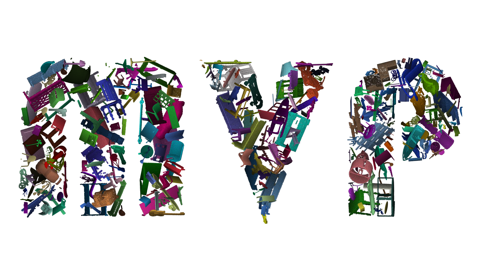

# *MVP Benchmark:* Multi-View Partial Point Clouds for Completion and Registration
<p align="center"> 

</p>


### MVP Benchmark Overview
This repository introduces the MVP Benchmark for partial point cloud **[COMPLETION](https://github.com/paul007pl/MVP_Benchmark/tree/main/completion)** and **[REGISTRATION](https://github.com/paul007pl/MVP_Benchmark/tree/main/registration)**, and it also includes following recent methods:

+ **Completetion:**
    [1] [PCN](https://github.com/wentaoyuan/pcn); [2] [ECG](https://github.com/paul007pl/ECG); [3] [VRCNet](https://github.com/paul007pl/VRCNet)

+ **Registration:**
    [1] [DCP](https://github.com/WangYueFt/dcp); [2] [DeepGMR](https://github.com/wentaoyuan/deepgmr); [3] [IDAM](https://github.com/jiahaowork/idam)

This repository is implemented in Python 3.7, PyTorch 1.5.0 and CUDA 10.1. 


### Installation
Install [Anaconda](https://docs.anaconda.com/anaconda/install/index.html), and then use the following command:
```
sh setup.sh
```

### MVP Dataset
Download corresponding dataset:
  + [Completion](https://www.dropbox.com/sh/fh3hd3d1qk4hgbm/AADCSMaDxrPRq9JMTECHqF-Qa?dl=0)
  + [Registration](https://www.dropbox.com/sh/cfionzubdy3zhay/AABzK5WqF_Yi_CV-MJoulsN4a?dl)


### Usage
For both completion and registration:
  + To train a model: run `python train.py -c *.yaml`, e.g. `python train.py -c pcn.yaml`
  + To test a model: run `python test.py -c *.yaml`, e.g. `python test.py -c pcn.yaml`
  + Config for each algorithm can be found in `cfgs/`.
  + `run_train.sh` and `run_test.sh` are provided for SLURM users. 


### ToDo List (coming soon)
+ ICCV2021 Workshop Webpage
+ Online Benchmark Evaluation Webpage


## Citation
If you find our code useful, please cite our paper:
```bibtex
@article{pan2021variational,
  title={Variational Relational Point Completion Network},
  author={Pan, Liang and Chen, Xinyi and Cai, Zhongang and Zhang, Junzhe and Zhao, Haiyu and Yi, Shuai and Liu, Ziwei},
  journal={arXiv preprint arXiv:2104.10154},
  year={2021}
}
```


## License
Our code is released under Apache-2.0 License.


## Acknowledgement
We include the following PyTorch 3rd-party libraries:  
[1] [CD](https://github.com/ThibaultGROUEIX/ChamferDistancePytorch)  
[2] [EMD](https://github.com/Colin97/MSN-Point-Cloud-Completion)  
[3] [MMDetection3D](https://github.com/open-mmlab/mmdetection3d)  

We include the following algorithms:  
[1] [PCN](https://github.com/wentaoyuan/pcn)  
[2] [ECG](https://github.com/paul007pl/ECG)  
[3] [VRCNet](https://github.com/paul007pl/VRCNet)  
[4] [DCP](https://github.com/WangYueFt/dcp)  
[5] [DeepGMR](https://github.com/wentaoyuan/deepgmr)  
[6] [IDAM](https://github.com/jiahaowork/idam)  
