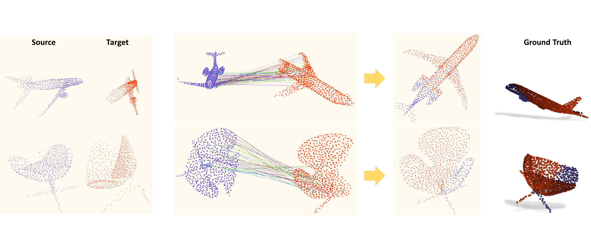

# *MVP Benchmark:* Partial-to-Partial Point Cloud Registration
<p align="center"> 

</p>

We include the following methods for point cloud registration:

[1] [DCP](https://github.com/WangYueFt/dcp);&nbsp;&nbsp; [2] [DeepGMR](https://github.com/wentaoyuan/deepgmr);&nbsp;&nbsp; [3] [IDAM](https://github.com/jiahaowork/idam)


### MVP Registration Dataset
<!-- Download the MVP registration dataset by the following commands:
```
cd data; sh download_data.sh
``` -->
Download the MVP registration dataset [Google Drive](https://drive.google.com/drive/folders/1RlUW0vmmyqxkBTM_ITVguAjxzIS1MFz4) or [百度网盘](https://pan.baidu.com/s/18pli79KSGGsWQ8FPiSW9qg)&nbsp;&nbsp;(code: p364) to the folder "data".

The data structure will be:
```
data
├── MVP_Train_RG.h5
|    ├── src (6400, 2048, 3)
|    ├── tgt (6400, 2048, 3)
|    ├── complete (6400, 2048, 3)
|    ├── cat_label (6400,)
|    ├── match_id (6400,)
|    └── match_level (6400,)
├── MVP_Test_RG.h5
|    ├── rotated_src (1200, 2048, 3)
|    ├── rotated_tgt (1200, 2048, 3)
|    ├── pose_src (1200, 4, 4)
|    ├── pose_tgt (1200, 4, 4)
|    ├── rot_level (1200,)
|    ├── transforms (1200, 4, 4)
|    ├── src (1200, 2048, 3)
|    ├── tgt (1200, 2048, 3)
|    ├── complete (1200, 2048, 3)
|    ├── cat_label (1200,)
|    ├── match_id (1200,)
|    └── match_level (1200,)
└── MVP_ExtraTest_RG.h5
     ├── rotated_src (2000, 2048, 3)
     ├── rotated_tgt (2000, 2048, 3)
     └── cat_label (2000,)
```

We create the registration dataset by ensuring surfficent overlaps between the source point cloud and the target.
Partial point cloud pairs with "match_level = 1" mostly have more correspondences than those with "match_level = 0".

Most relative rotations are within [0, 45\textdegree], and the rest have unrestricted rotations \in [0, 360\textdegree].
The ratio is roughly 4 : 1.

Note that the source and the target are two different incomplete point clouds scanned from the same CAD model.


### Usage
+ To train a model: run `python train.py -c ./cfgs/*.yaml`, e.g. `python train.py -c ./cfgs/pcn.yaml`
+ To test a model: run `python test.py -c ./cfgs/*.yaml`, e.g. `python test.py -c ./cfgs/pcn.yaml`
+ Config for each algorithm can be found in `cfgs/`.
+ `run_train.sh` and `run_test.sh` are provided for SLURM users. 


## Citation
If you find our code useful, please cite our paper:
```bibtex
@article{pan2021variational,
  title={Variational Relational Point Completion Network},
  author={Pan, Liang and Chen, Xinyi and Cai, Zhongang and Zhang, Junzhe and Zhao, Haiyu and Yi, Shuai and Liu, Ziwei},
  journal={arXiv preprint arXiv:2104.10154},
  year={2021}
}
```

## License
Our code is released under Apache-2.0 License.


## Acknowledgement
We include the following algorithms:  
[1] [DCP](https://github.com/WangYueFt/dcp)     
[2] [DeepGMR](https://github.com/wentaoyuan/deepgmr)     
[3] [IDAM](https://github.com/jiahaowork/idam)    
